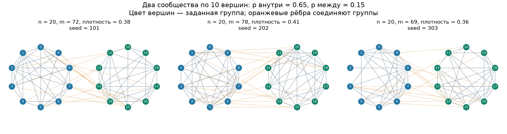
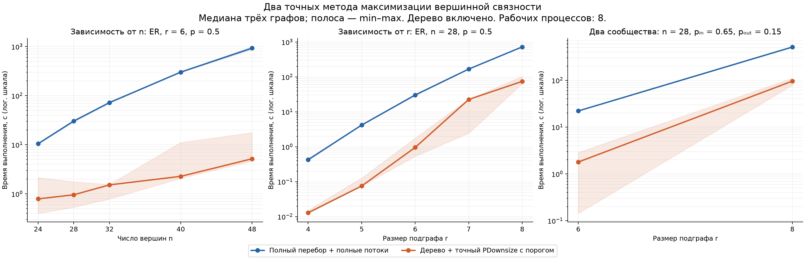

В данном эксперименте я сравнивал подходы к полному перебору задачи.

Была гипотеза, что исходный авторский, где в качестве имплементации `PDownsize`, использовать следующий подход. Пусть дан на вход $k$-связный граф $G \langle V, E \rangle$. Будем перебирать подграфы размера $r$. Мы фиксируем некий подграф $G'\langle V', E' \rangle \subset G$ ровно на $r$ вершинах.
Мы хотим проверить, что между всякой парой вершин $u, v \in V$ есть хотя бы $k$ вершинно-непересекающихся путей. Тогда если это так, то по теореме Менгера моментально получаем, что $G'$ является $k$-связным. Проверка вершин на это условие достигается просто. Перестроим $G'$ в сеть следующим образом. Каждую вершину $v \in V'$ разделим на две вершины $v_{in}$ и $v_{out}$ и проведем ребро $(v_{in}, v_{out})$ с емкостью $1$. Далее если в исходном графе $(u, v) \in E$, то проводим ребра $(v_{out}, u_{in}), (u_{out}, v_{in})$. Оба ребра емкостью $1$. Тогда легко видеть, что если в такой сети есть поток величины хотя бы $k$, то условие выполнено.

В противовес ставился алгоритм, который перебирает всевозможные подграфы размера $r$ и находит их максимальную вершинную-связность (то есть ищет уже максимальный поток, а не хотя бы $k$).

В скриптах тестируется следующие тест кейсы:
- Фиксируем $r = 6$ и увеличиваем размер исходного графа ($|V| = 24, 28, 32, 40, 48$).
- Фиксирует $|V| = 28$ и увеличиваем $r$ ($r = 4, 5, 7, 8$).
- Две "хорошо"-связанные компоненты, которые друг с другом не пересекаются, но связаны ребрами. Меняем вероятность появления между компнентами.

Пример последнего типа графов

Итого времена выполнения получились следующими:

