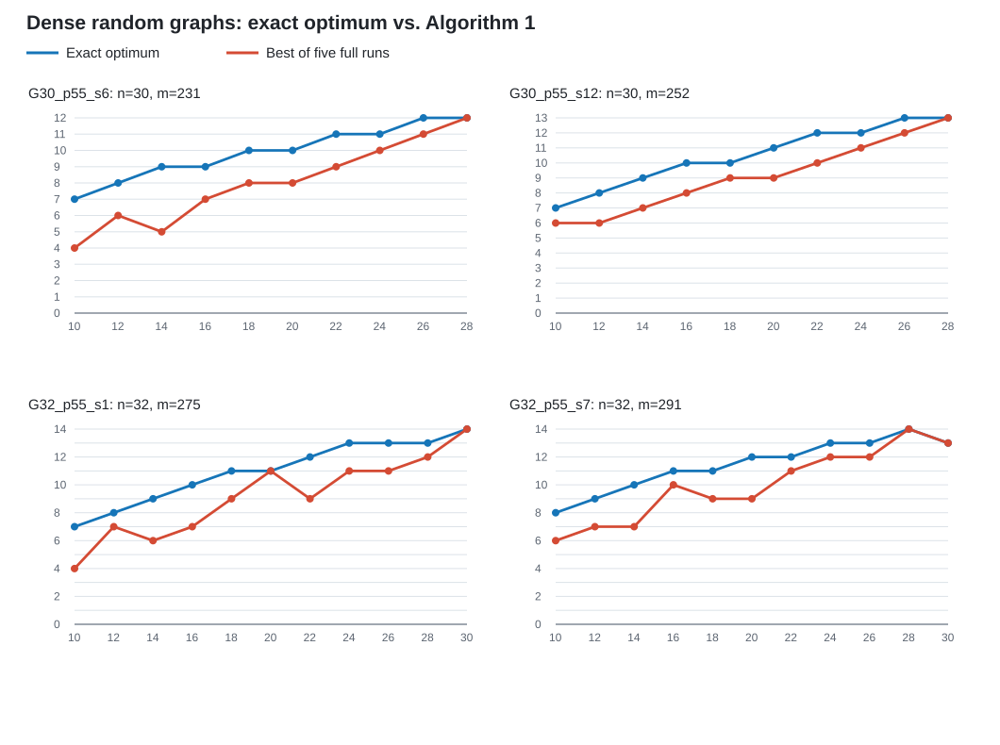

В данном эксперименте я тестировал корректность оптимума возвращаемого оригинальным алгоритмом авторов.

Алгоритм тестировался на четырех случайных графах. В каждом вероятность проведения ребра ровно $0.55$. И для каждого графа тестировались разные значения $r$.

Далее GN_pP_sS читать как граф размера N с вероятностью появления ребра P с сидом S.

